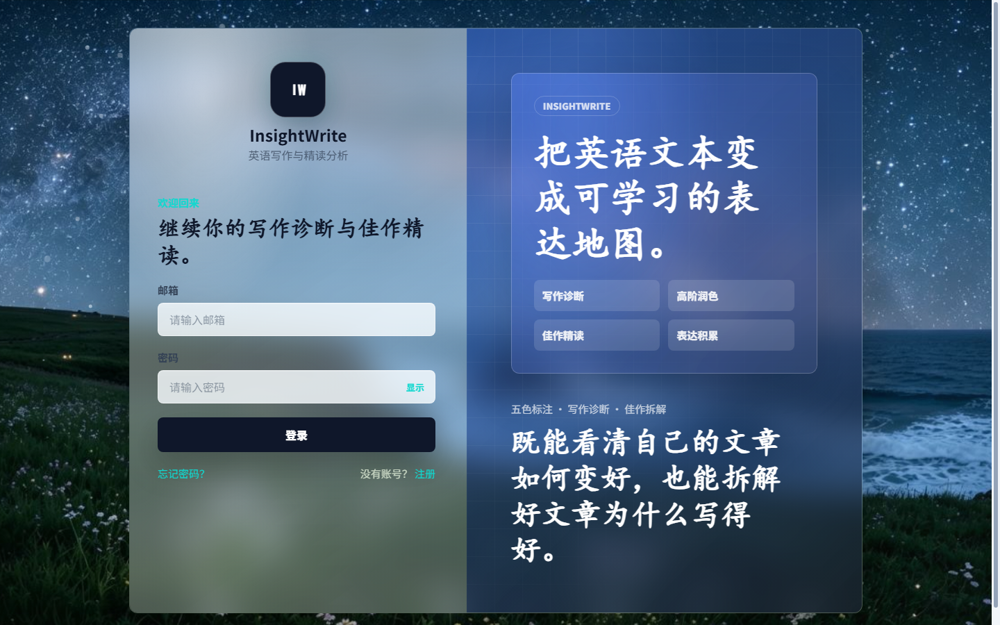
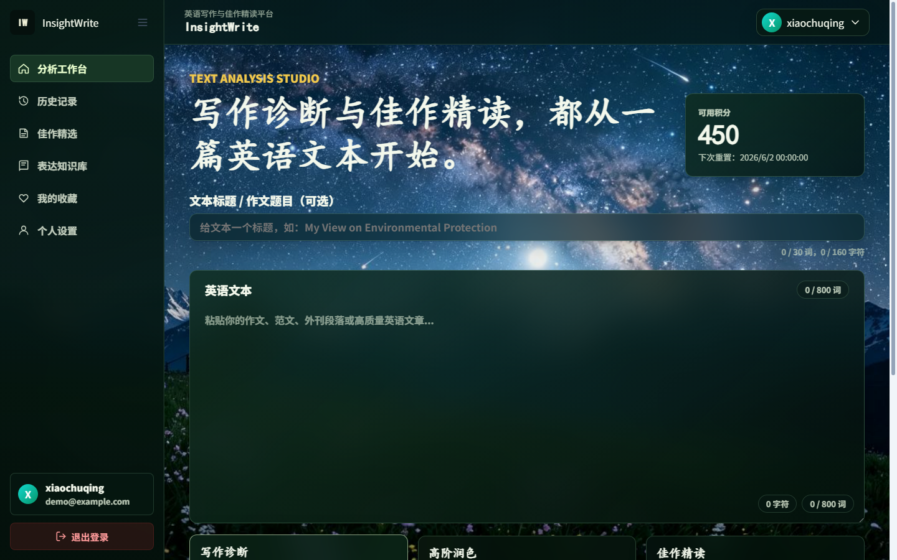
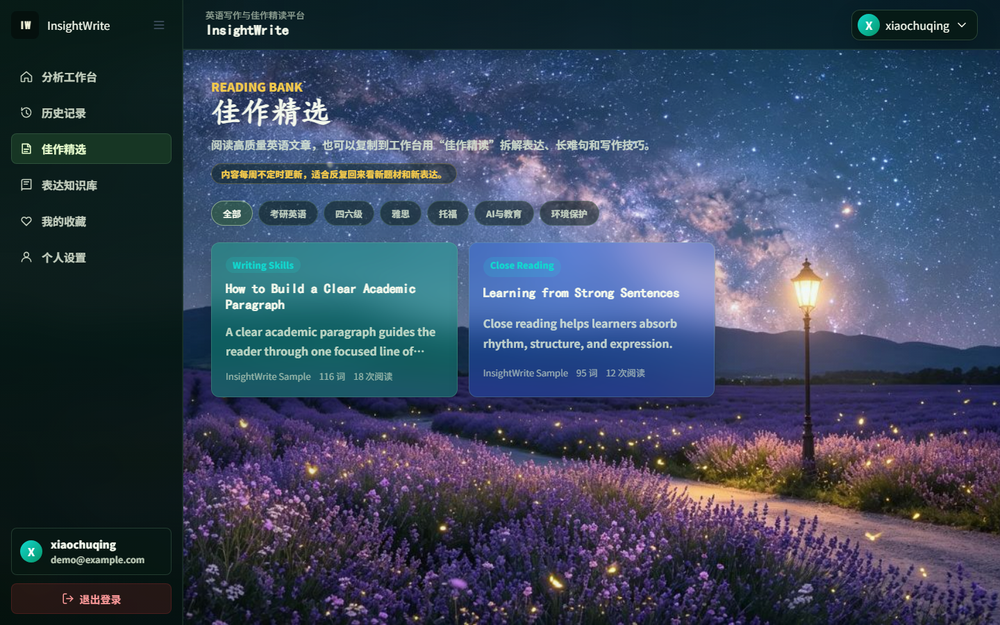
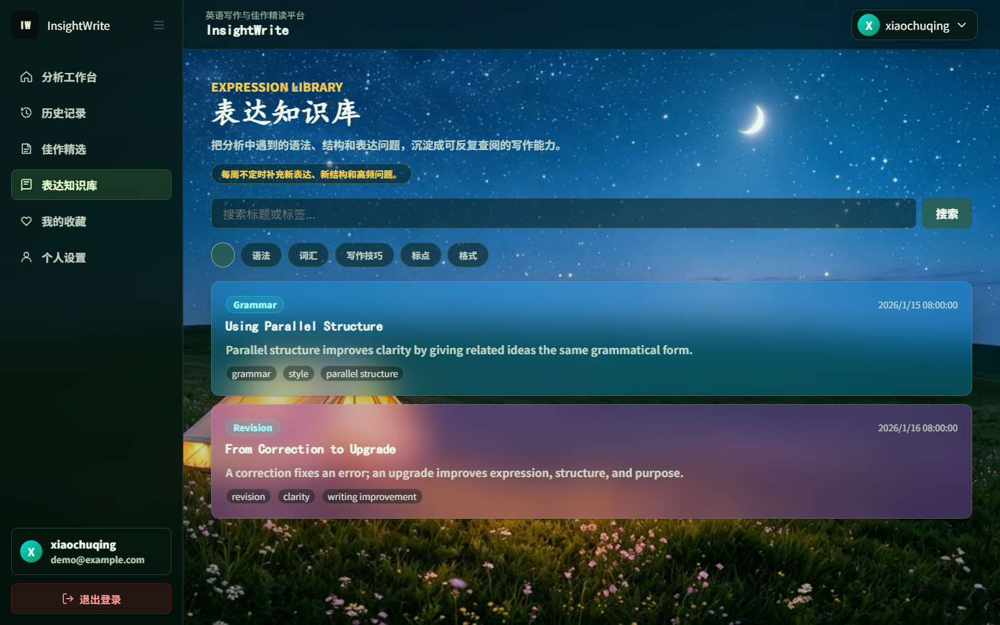
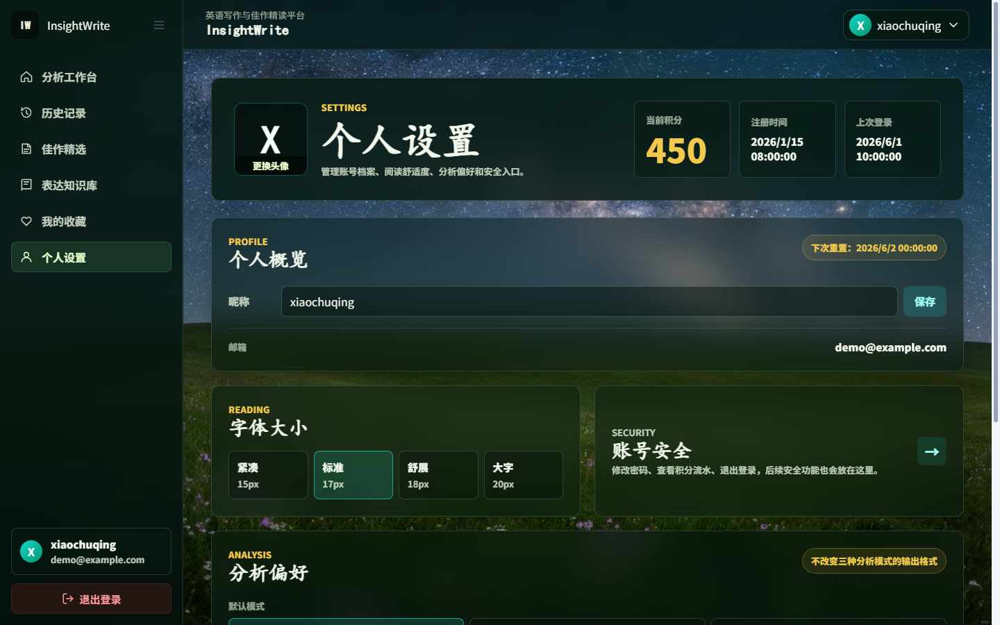

# InsightWrite 2.0

InsightWrite 2.0 is a personal full-stack AI English learning application built around two learning paths:

- improving through diagnosis, revision, and guided upgrade of the user's own writing;
- learning through close reading, appreciation, and absorption of strong English examples.

The project combines a Vue 3 frontend, a Spring Boot backend, MySQL persistence, authentication, AI-assisted analysis, favorites, history, profile workflows, and a credit-based usage control system. The credit system is designed for AI cost protection and abuse prevention, not for commercial payment or profit.

This repository is published as an open-source portfolio and reference project. It is not currently deployed as a public online service because live AI usage and long-term operation would create ongoing cost and maintenance obligations.

## Highlights

- Full-stack application structure with a Vue 3 + Vite frontend and a Spring Boot 3 backend.
- AI writing diagnosis, higher-level revision guidance, and close-reading learning workflows.
- Authentication, password reset, JWT-based sessions, profile management, and account security pages.
- Credit-based AI usage control for quota management, cost awareness, and abuse prevention.
- History, favorites, article learning, and knowledge-base flows.
- Frontend-focused product experience with custom visual design, route structure, reusable components, and responsive pages.
- Backend layering across controllers, services, repositories, DTOs, entities, configuration, and security utilities.
- Local startup script, Docker deployment files, schema script, example environment files, and security-focused tests.

## Screenshots

Screenshots are stored under `docs/screenshots/`.

| Page | Preview |
| --- | --- |
| Welcome |  |
| Login |  |
| Workspace |  |
| Articles |  |
| Knowledge |  |
| Profile |  |

## Tech Stack

Frontend:

- Vue 3
- Vue Router 4
- Vite
- Axios
- CSS modules organized through global variables and view-level styles

Backend:

- Java 17
- Spring Boot 3
- Spring MVC
- Spring Data JPA
- MySQL 8
- JWT
- Spring Security Crypto
- Spring Mail

## Repository Structure

```text
.
├── backend/              # Spring Boot backend
├── frontend/             # Vue 3 frontend
├── sql/                  # Database schema
├── docker/               # Optional Docker deployment files
├── docs/screenshots/     # README screenshots
├── .env.example          # Local environment template
├── start.bat             # Windows local full-stack startup script
└── README.md
```

## Local Setup

Prerequisites:

- JDK 17
- Maven 3.9+
- Node.js 18+
- MySQL 8.0+
- A DeepSeek API key
- An SMTP account if you want to use email verification and password reset

Create the local database:

```sql
CREATE DATABASE insightwrite CHARACTER SET utf8mb4 COLLATE utf8mb4_unicode_ci;
```

Install frontend dependencies:

```powershell
cd frontend
npm.cmd install
cd ..
```

Copy the environment template and fill in your own local values:

```powershell
Copy-Item .env.example .env
```

Required values in `.env`:

- `DB_USERNAME` and `DB_PASSWORD`: your local MySQL account for the `insightwrite` database.
- `JWT_SECRET`: a random value at least 32 bytes long.
- `DEEPSEEK_API_KEY`: your own DeepSeek API key.
- `MAIL_USERNAME` and `MAIL_PASSWORD`: your SMTP account and authorization code.

Start both services:

```powershell
.\start.bat
```

After startup:

- Backend: `http://localhost:8080`
- Frontend: `http://localhost:5173`

The backend reads the root `.env` file during local startup. The real `.env` file is intentionally ignored by Git and must not be committed.

## Manual Startup

Backend:

```powershell
cd backend
mvn.cmd spring-boot:run
```

Frontend:

```powershell
cd frontend
npm.cmd run dev
```

## Database

The schema is available at:

```text
sql/schema.sql
```

The repository does not include real user data. If you want Spring Boot to initialize sample learning content during local development, set:

```properties
SQL_INIT_MODE=always
```

in your local `.env` file. For normal development, the default is:

```properties
SQL_INIT_MODE=never
```

## Docker

Docker deployment files are provided as a reference under `docker/`.

```powershell
Copy-Item docker\.env.example docker\.env
```

Fill in production-safe values, build the frontend, provide TLS certificates under `docker/certs`, then start the stack from the `docker/` directory.

This project is not currently offered as a hosted production service.

## Verification

Frontend build:

```powershell
cd frontend
npm.cmd run build
```

Backend compile:

```powershell
cd backend
mvn.cmd -q -DskipTests compile
```

Backend tests:

```powershell
cd backend
mvn.cmd test
```

## Security Notes

- No real API keys, database credentials, SMTP authorization codes, tokens, or secrets should be committed.
- `.env` and local override files are ignored by Git.
- The project includes tests around authentication, JWT behavior, sensitive defaults, credit atomicity, input limits, and deployment-sensitive configuration.
- A security review was performed before preparing the project for open-source publication, but this repository is provided as a reference project and does not guarantee production security for every deployment environment.

## 中文补充

InsightWrite 2.0 侧重两类英语学习路径：一类是围绕用户自己的写作进行批改、升级和复盘学习；另一类是通过佳作精读、欣赏和吸收来提升表达能力。

项目中的积分系统不是为了商业盈利或真实支付，而是用于模拟和实现 AI 请求额度、成本保护与防滥用控制。由于线上 AI 调用和长期维护会产生持续成本，本项目目前不提供公开部署版本。

## License

Licensed under the Apache License, Version 2.0. See [LICENSE](LICENSE).
