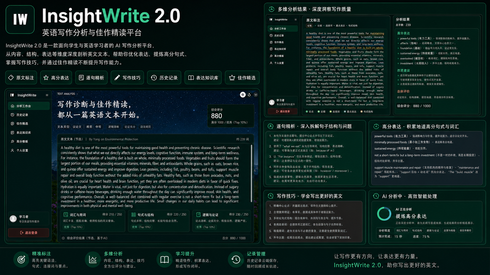
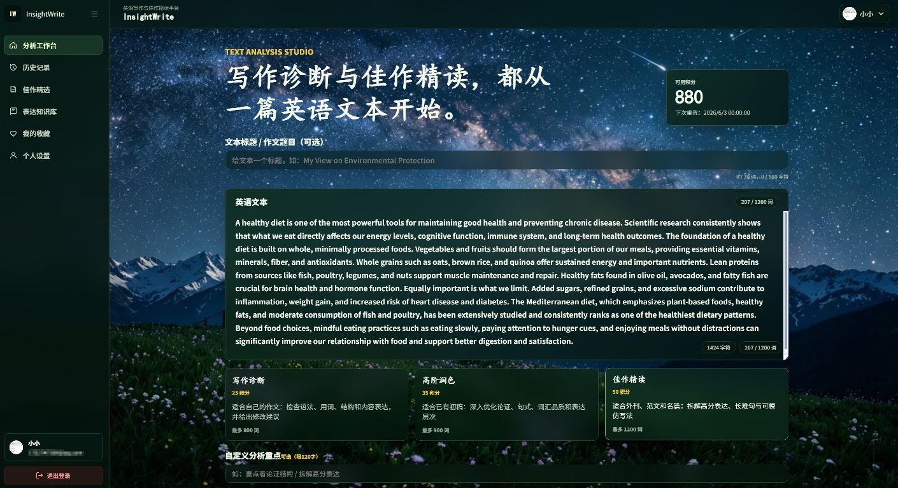

# InsightWrite 2.0

InsightWrite 2.0 is a full-stack AI English writing and learning product for turning one piece of writing into a structured learning cycle: diagnosis, inline annotation, revision guidance, expression upgrade, review, and knowledge absorption.

It is published as an open-source portfolio and reference project, with emphasis on product experience, AI-assisted learning workflows, full-stack implementation, and security-conscious engineering.



## Product Focus

| Area | What it demonstrates |
| --- | --- |
| AI writing diagnosis | Multi-dimensional scoring and feedback for vocabulary, sentence structure, logic, and writing technique. |
| Inline annotations | Original-text markup that connects specific sentences and phrases to concrete explanations. |
| Revision guidance | Upgrade suggestions designed to teach better expression instead of only returning a corrected draft. |
| Learning loop | History, favorites, curated reading, and an expression knowledge base for repeated review. |
| Usage control | A credit system for AI cost awareness, quota management, and abuse prevention. |
| Portfolio value | A complete product surface across frontend experience, backend services, auth, persistence, and tests. |

## Product Screens

The welcome page introduces the product identity and learning direction before users enter the writing workspace.


The main workspace is designed around writing input, task context, score visibility, mode selection, and follow-up learning actions.



## Core Workflow


## Engineering Highlights

| Layer | Implementation |
| --- | --- |
| Frontend | Vue 3, Vite, Vue Router, Axios, reusable views/components, responsive visual system. |
| Backend | Spring Boot 3, Spring MVC, JPA, MySQL, layered controllers, services, repositories, DTOs, and entities. |
| Authentication | JWT sessions, email verification, password reset, profile and account security workflows. |
| AI integration | Prompted analysis service, structured result parsing, inline annotation extraction, and mode-aware feedback. |
| Credits | Balance checks, usage transactions, AI-cost protection, and atomic credit-safety tests. |
| Security | Sensitive config isolation, input limits, JWT hardening, auth-flow tests, and deployment-aware config checks. |

## Why This Exists

InsightWrite is not designed to replace writing practice, and it is not just a wrapper around a one-time AI correction. ChatGPT or DeepSeek can revise an essay in a single conversation, but that feedback is easy to lose and hard to turn into a repeatable learning process.

InsightWrite is designed to make AI feedback reusable. It connects diagnosis, original-text annotations, revision suggestions, history, favorites, curated examples, and expression knowledge into one product flow, so a learner can see what changed, why it matters, and how to review it later.

## 2.0 Meaning

The `2.0` name represents a rebuilt full-stack version with authentication, persistence, credit control, profile workflows, a stronger frontend experience, and a more complete writing-learning loop.

## Repository Structure

| Path | Purpose |
| --- | --- |
| `backend/` | Spring Boot backend application. |
| `frontend/` | Vue 3 frontend application. |
| `sql/` | MySQL database schema. |
| `docker/` | Optional Docker and Nginx deployment references. |
| `docs/showcase/` | Portfolio images used by this README. |
| `.env.example` | Local environment template without secrets. |
| `start.bat` | Windows local full-stack startup script. |

## Local Setup

Prerequisites:

- JDK 17
- Maven 3.9+ available through PATH, unless a Maven Wrapper is added later
- Node.js 18+
- MySQL 8.0+
- A DeepSeek API key
- An SMTP account if email verification and password reset are used

Create the local database:

```sql
CREATE DATABASE insightwrite CHARACTER SET utf8mb4 COLLATE utf8mb4_unicode_ci;
```

Install frontend dependencies:

```powershell
cd frontend
npm.cmd install
cd ..
```

Copy the environment template and fill in local values:

```powershell
Copy-Item .env.example .env
```

Required `.env` values:

| Variable | Purpose |
| --- | --- |
| `DB_USERNAME`, `DB_PASSWORD` | Local MySQL account for the `insightwrite` database. |
| `JWT_SECRET` | Random secret at least 32 bytes long. |
| `DEEPSEEK_API_KEY` | Local AI provider API key. |
| `MAIL_USERNAME`, `MAIL_PASSWORD` | SMTP account and authorization code. |

Start both services:

```powershell
.\start.bat
```

After startup:

| Service | URL |
| --- | --- |
| Backend | `http://localhost:8080` |
| Frontend | `http://localhost:5173` |

The real `.env` file is intentionally ignored by Git and must not be committed.

## Manual Startup

Backend:

```powershell
cd backend
mvn.cmd spring-boot:run
```

Frontend:

```powershell
cd frontend
npm.cmd run dev
```

## Database

The schema is available at `sql/schema.sql`.

The repository does not include real user data. To initialize sample learning content during local development, set this in `.env`:

```properties
SQL_INIT_MODE=always
```

For normal development, keep the default:

```properties
SQL_INIT_MODE=never
```

## Docker Reference

Docker files are provided as deployment references under `docker/`. They are not required for local development.

```powershell
Copy-Item docker\.env.example docker\.env
```

Use production-safe values, build the frontend, provide TLS certificates under `docker/certs`, and run the stack from the `docker/` directory on a Docker-capable host.

This project is not currently offered as a hosted public service because live AI calls and long-term operation would create ongoing cost and maintenance obligations.

## Verification

Frontend build:

```powershell
cd frontend
npm.cmd run build
```

Backend compile:

```powershell
cd backend
mvn.cmd -q -DskipTests compile
```

Backend tests:

```powershell
cd backend
mvn.cmd test
```

## Security Notes

- No real API keys, database credentials, SMTP authorization codes, tokens, or secrets should be committed.
- `.env`, build outputs, uploaded files, and local runtime files are ignored by Git.
- The project includes tests around authentication, JWT behavior, sensitive defaults, credit atomicity, input limits, and deployment-sensitive configuration.
- A security review was performed before open-source publication, but this repository is a reference project and still requires environment-specific production review before real deployment.

## 中文补充

InsightWrite 2.0 侧重两类英语学习路径：一类是围绕用户自己的写作进行诊断、批注、修改升级和复盘；另一类是通过佳作精读、表达知识库和收藏记录吸收更好的表达方式。

项目中的积分系统不是商业支付设计，而是用于 AI 调用成本保护、额度管理和防滥用控制。当前仓库作为作品集和开源参考项目发布，不提供公开在线部署版本。

## License

Licensed under the Apache License, Version 2.0. See [LICENSE](LICENSE).
